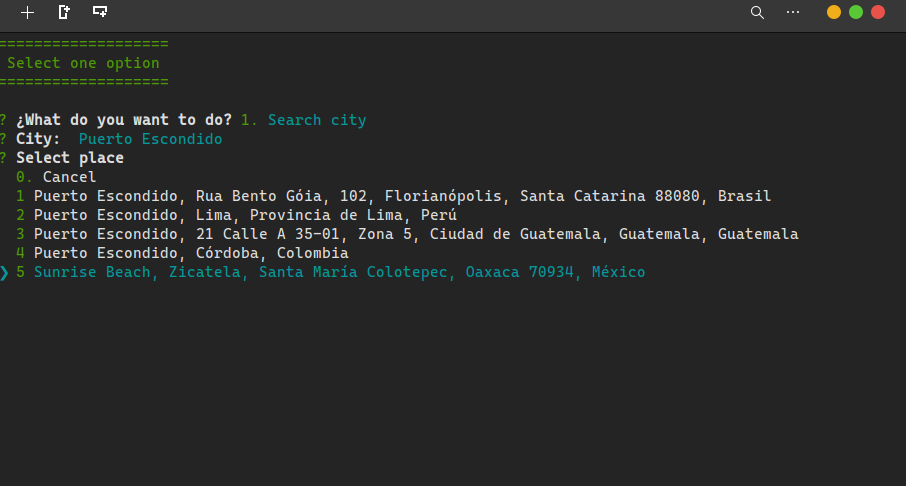

# NodeJS

### Proyecto
 

### 🔎 Cómo trabajar en este proyecto?
Crea un menu interactivo para poder saber el clima de las distintos lugares del mundo, y manten un instorial de los lugares visitados, implementando Mapbox y OpenWeatherMap.